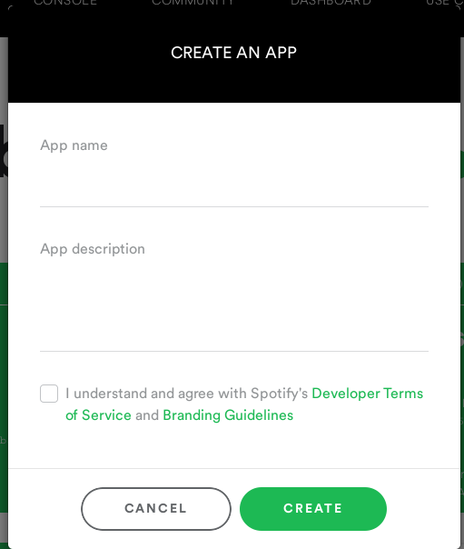
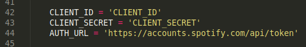
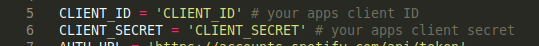

# pyspodl, a python script to download songs or playlists from spotify

using [librespot-python by kokarare1212](https://github.com/kokarare1212/librespot-python)'s module

# screenshots

click <a href="screenshots.md">here</a>

# last updated

Friday, August 12, 2022

# what can you do?

+ download songs, playlists and albums (new)
+ get playlist, track and album (new) info
+ search for tracks

# how to use

+ First, you'll need a client ID and secret key. Get them by making a application in [spotify dashboard](https://developer.spotify.com/dashboard/applications)
+ Create an application and copy the client ID and secret

+ git clone the repo
+ Paste client id and secret in `pyspodl` in line 42 and 43, and in `gettoken` in line 5 and 6

+ Make sure you have python 3.6+, git, and then `pip3 install git+https://github.com/kokarare1212/librespot-python`
+ python3 pyspodl (or on linux chmod +x pyspodl && ./pyspodl)

---

Feel free to fork or make PR's (Pull requests). If you're forking, please leave [this repos link](https://github.com/devlocalhost/pyspodl) on your readme, and [kokarare1212's module repo link](https://github.com/kokarare1212/librespot-python). 
If you face any issues/want to report a bug, or want to request a feature, open a issue
